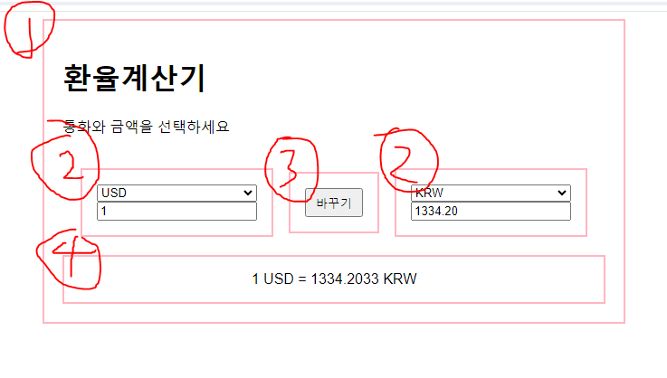

컴포넌트는 총 4개로 정리된다고 판단했다.

1. 환율 계산기 전체 컨테이너

2. Select box 밑 input 창

3. 바꾸기 버튼

4. 2번에서 input 값 변경 및 select 값 변경시에 단위별 환율 보여주는 창

컴포넌트는 (1) 외관 (2) 기능으로 나눌 수 있다.
컴포넌트 분리해서 함수형 프로그래밍을 하는 이유는 반복 및 유지 보수에 강점이 있기 때문이다.

2번에서 일어나는 이벤트가 4번에 전달되야 하고,
3번에서 일어나는 이번트가 2번과 4번에 전달되야 한다.
이런 것들에 대해서 핸들링하려면 2,3,4의 부모인 1번이 이것을 핸들링해야 한다.

# 주의점

          app.innerHTML = `
            <h1>환율계산기</h1>
            
통화와 금액을 선택하세요

            

                ${this.currencyOne.render()}
                ${this.swap.render()}
                ${this.currencyTwo.render()}
            

            ${this.rate.render()}
            `;

위 처럼 사용하고 싶은 경우
this.swap.render() 는 아래와 같이 작성되야 한다.
render() {
return `

         `;

아래와 같이 작성하면 dom 객체가 리턴되기 때문에 객체를 toString() 한 [object HTMLDivElement] 문자열이 출력됨.
const element = document.createElement("div");
element.classList.add("rate");
element.id = "rate";
return element;

# 컴포넌트 별 코드

1.  환율 계산기 전체 컨테이너

    class Calculator {
    constructor() {
    this.currencyOne = new Currency("one");
    this.currencyTwo = new Currency("two");
    this.swap = new Swap();
    this.rate = new Rate();
    }

        // DOM 요소 캐싱 메서드 Render 이후에 호출해야 한다.
        cacheDOMElements() {
          this.currencyEl_one = document.getElementById("currency-one");
          this.currencyEl_two = document.getElementById("currency-two");
          this.amountEl_one = document.getElementById("amount-one");
          this.amountEl_two = document.getElementById("amount-two");
          this.swapButton = document.getElementById("swap");
          this.rateEl = document.getElementById("rate");
        }

        //환율 리스트 가져오는 메소드
        async getList() {
          const res = await fetch(
            "https://open.exchangerate-api.com/v6/latest"
          );
          const { rates } = await res.json();
          return rates;
        }

        //환율 리스트 가져와서 세팅 후 계산 해주는 함수
        async optionList() {
          const list = await this.getList();
          this.populateOptions(this.currencyEl_one, list, "USD");
          this.populateOptions(this.currencyEl_two, list, "KRW");
          this.calculate();
        }

        //select Element에 option 리스트 추가해주는 메소드
        populateOptions(selectEl, list, defaultCurrency) {
          for (const key in list) {
            const option = document.createElement("option");
            option.value = key;
            option.innerText = key;
            option.setAttribute("data-rate", list[key]);

            if (key === defaultCurrency) {
              option.selected = true;
            }

            selectEl.appendChild(option);
          }
        }

        /*
        2번에서 일어나는 이벤트가 4번에 전달,
        3번에서 일어나는 이번트가 2번과 4번에 전달하는 메소드
        */
        calculate = () => {
          const currency_one = this.currencyEl_one.value;
          const currency_two = this.currencyEl_two.value;

          const rate_one = parseFloat(
            this.currencyEl_one.options[
              this.currencyEl_one.selectedIndex
            ].getAttribute("data-rate")
          );

          const rate_two = parseFloat(
            this.currencyEl_two.options[
              this.currencyEl_two.selectedIndex
            ].getAttribute("data-rate")
          );

          const rate = rate_two / rate_one;
          this.rateEl.innerText = `1 ${currency_one} = ${rate.toFixed(
            4
          )} ${currency_two}`;

          this.amountEl_two.value = (this.amountEl_one.value * rate).toFixed(2);
        };

        //이벤트 리스너 추가
        addEventListeners() {
          this.currencyEl_one.addEventListener("change", this.calculate);
          this.amountEl_one.addEventListener("input", this.calculate);
          this.currencyEl_two.addEventListener("change", this.calculate);
          this.amountEl_two.addEventListener("input", this.calculate);

          this.swapButton.addEventListener("click", () => {
            this.swapValues();
            this.calculate();
          });
        }

        //값 바꾸는 함수.
        swapValues() {
          const tempCurrency = this.currencyEl_one.value;
          this.currencyEl_one.value = this.currencyEl_two.value;
          this.currencyEl_two.value = tempCurrency;

          const tempAmount = this.amountEl_one.value;
          this.amountEl_one.value = this.amountEl_two.value;
          this.amountEl_two.value = tempAmount;
        }
        render() {
          const app = document.getElementById("app");
          app.innerHTML = `
            <h1>환율계산기</h1>
            
통화와 금액을 선택하세요

            

                ${this.currencyOne.render()}
                ${this.swap.render()}
                ${this.currencyTwo.render()}
            

            ${this.rate.render()}
            `;
        }

    }

2.  Select box 밑 input 창

    class Currency {
    constructor(number) {
    this.number = number;
    }
    render() {
    return `           

            <select id="currency-${this.number}"></select>
            <input type="number" id="amount-${this.number}" placeholder="0" value="1" />
        

      `;
    }
    }

3.  바꾸기 버튼

    class Swap {
    constructor() {}
    render() {
    return `       

        <button class="btn" id="swap">바꾸기</button>
    
`;
    }
    }

4.  2번에서 input 값 변경 및 select 값 변경시에 단위별 환율 보여주는 창

    class Rate {
    constructor() {}
    render() {
    return `

 `;
    }
    }
